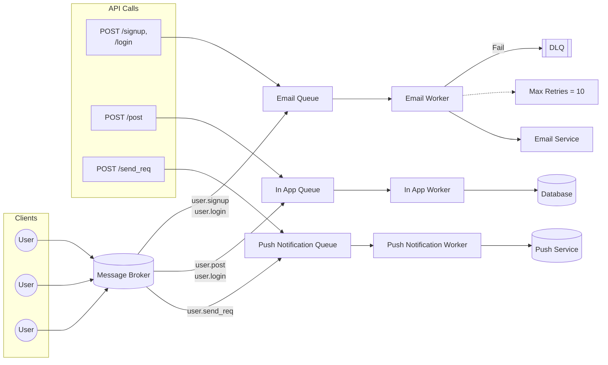

# Message Queue Simulator (Bun)

This project demonstrates a lightweight **Message Broker → Queue → Worker → Service** pipeline in **Bun**, modeled after a real event-driven architecture.

It includes:

- In-memory message broker
- Queues (Email, InApp, Push)
- Workers with retry logic and Dead Letter Queue (DLQ)
- Mocked external services (Email, Database, Push)

---

## Architecture (Mermaid Diagram)



---

## Running the Service

```bash
bun run src/index.ts
```

The server will start at `http://localhost:3000`.

---

## Testing APIs

Use `curl` or Postman to simulate clients:

```bash
# Signup
curl -X POST http://localhost:3000/signup \
  -H "Content-Type: application/json" \
  -d '{"user":"alice"}'

# Login
curl -X POST http://localhost:3000/login \
  -H "Content-Type: application/json" \
  -d '{"user":"bob"}'

# Post
curl -X POST http://localhost:3000/post \
  -H "Content-Type: application/json" \
  -d '{"content":"hello"}'

# Send request
curl -X POST http://localhost:3000/send_req \
  -H "Content-Type: application/json" \
  -d '{"to":"charlie"}'
```

---

## Expected Logs

On success:

```
EmailWorker processing: {...}
Sending email via SES mock: {...}
InAppWorker processing: {...}
Saving to DB: {...}
PushWorker processing: {...}
Sending Push notification: {...}
```

On failure (if worker throws):

```
EmailWorker failed
DLQ received: {...}
```

---

## DLQ (Dead Letter Queue)

- Each queue retries failed messages up to **10 times**.
- After that, the message is pushed into the **DLQ**.
- You can inspect DLQ contents by checking console logs.

```

```
